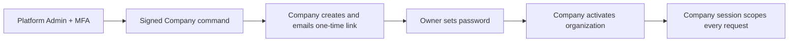

# Closed, Invite-Only Access Control

## Purpose

This Company service has no public registration route or registration screen. A company owner can enter the invoicing workspace only after accepting a one-time invitation issued by the separately deployed Platform Admin service.

OAuth and third-party sign-in are intentionally not part of this release. Company authentication uses a first-party, server-side session so authorization and tenant isolation remain under application control.

## Boundaries

| Identity               | Access                  | Boundary                                                                       |
| ---------------------- | ----------------------- | ------------------------------------------------------------------------------ |
| Public visitor         | No company data         | Can submit only a valid invitation token to activate the invited account.      |
| Company owner          | One active organization | Can access only data scoped to the organization encoded in the server session. |
| Platform administrator | Separate Admin host     | Cannot reach company invoices through the Admin API.                           |

The Company service issues invitations and sends their email only after an
authenticated internal Admin command. It cannot read platform-admin accounts or
manage platform MFA. Admin cannot read Company MongoDB or receive raw tokens.

## Access Flow



1. A platform administrator signs in to the separate Admin Console using a password and TOTP.
2. Admin sends a signed, replay-protected, idempotent provisioning command.
3. Company creates the pending organization, derives the single-use token,
   stores only its HMAC, and sends the URL through Company SMTP. The token is
   never returned to Admin.
4. The owner opens the company-app link, creates a strong password, and the Company service atomically creates the owner, profile, and active organization.
5. The Company service issues an opaque, HTTP-only company session and scopes every protected request by its organization ID.

The invitation token is placed in the URL fragment (`/#invite=...`), which browsers do not include in ordinary server logs or HTTP referrer paths.

## Company API

Every authenticated unsafe request requires the `X-CSRF-Token` returned by `GET /api/auth/me`.

| Method                        | Endpoint                             | Purpose                                                  |
| ----------------------------- | ------------------------------------ | -------------------------------------------------------- |
| `GET`                         | `/api/health`                        | Public health status                                     |
| `GET`                         | `/api/auth/me`                       | Current company session and CSRF token                   |
| `POST`                        | `/api/auth/login`                    | Company owner sign-in                                    |
| `POST`                        | `/api/auth/logout`                   | End current company session                              |
| `POST`                        | `/api/invitations/accept`            | Redeem a valid one-time invitation                       |
| `GET`                         | `/api/invoices/*`                    | Read only the current organization's invoices and drafts |
| `POST`/`PUT`/`PATCH`/`DELETE` | `/api/invoices/*`, `/api/settings/*` | Mutate only the current organization's data              |

`POST /api/auth/register` and all `/api/platform/*` routes return `404`.

## Internal Admin Contract

The Company service exposes a deliberately narrow `/api/internal/*` route group only for the Platform Admin service. It is not a browser API. Render Free requires public HTTPS; use private networking after upgrading the hosting plan.

- Each version 2 request signs the method, exact path/query, timestamp, random
  nonce, and SHA-256 body digest with `ADMIN_INTERNAL_SHARED_SECRET`.
- Company rejects browser origins, invalid signatures/body digests, nonce
  replay, and timestamps more than 60 seconds old.
- The allowlist covers bounded organization/invitation views and explicit
  provisioning, status, and session-revocation commands documented in
  `SERVICE_DATABASE_ISOLATION.md`.
- Every write has a signed UUID request ID and a persistent idempotency receipt.

## Required Company Environment

```env
AUTH_REQUIRED=true
SESSION_SECRET=<unique random 32+ character company session secret>
INVITATION_TOKEN_SECRET=<Company-only invitation secret>
ADMIN_INTERNAL_SHARED_SECRET=<same value configured in Platform Admin>
COOKIE_SECURE=true
SESSION_COOKIE_SAMESITE=lax
TRUST_PROXY=true
ALLOW_DATABASE_RESET=false
SMTP_HOST=<Company mail provider>
SMTP_PORT=2525
SMTP_USER=<Company mail user>
SMTP_PASSWORD=<Company mail credential>
SMTP_FROM=<verified sender>
SMTP_SECURE=false
```

Do not put the platform session secret, platform database URI, or platform TOTP encryption key in this repository's production environment. Never expose SMTP or any backend secret through a `VITE_*` variable, Git, browser storage, screenshots, or logs.

## Operational Rules

- Verify the owner email before the administrator sends an invitation.
- Renew an invitation instead of forwarding it; renewal invalidates the previous link.
- Suspend a company in the Admin Console when compromise is suspected. Company authentication independently rejects suspended organizations even before session cleanup completes.
- Rotate `SESSION_SECRET` if the Company session key might be exposed; this invalidates all Company sessions.
- Rotate `ADMIN_INTERNAL_SHARED_SECRET` through a coordinated maintenance
  procedure. Rotate `INVITATION_TOKEN_SECRET` only in Company; doing so
  intentionally invalidates outstanding invitation links.
- Keep the Company and Platform Admin repositories, deployments, logs, and MongoDB credentials separate.
