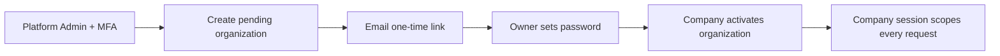

# Closed, Invite-Only Access Control

## Purpose

This Company service has no public registration route or registration screen. A company owner can enter the invoicing workspace only after accepting a one-time invitation issued by the separately deployed Platform Admin service.

OAuth and third-party sign-in are intentionally not part of this release. Company authentication uses a first-party, server-side session so authorization and tenant isolation remain under application control.

## Boundaries

| Identity | Access | Boundary |
| --- | --- | --- |
| Public visitor | No company data | Can submit only a valid invitation token to activate the invited account. |
| Company owner | One active organization | Can access only data scoped to the organization encoded in the server session. |
| Platform administrator | Separate Admin host | Cannot reach company invoices through the Admin API. |

The Company service cannot issue invitations, send invitation emails, read platform-admin accounts, or manage platform MFA.

## Access Flow



1. A platform administrator signs in to the separate Admin Console using a password and TOTP.
2. The Admin service creates a `pending` organization and an HMAC-hashed, single-use invitation token.
3. The Admin service sends the raw invitation URL only through its SMTP provider. It never returns or stores the raw token.
4. The owner opens the company-app link, creates a strong password, and the Company service atomically creates the owner, profile, and active organization.
5. The Company service issues an opaque, HTTP-only company session and scopes every protected request by its organization ID.

The invitation token is placed in the URL fragment (`/#invite=...`), which browsers do not include in ordinary server logs or HTTP referrer paths.

## Company API

Every authenticated unsafe request requires the `X-CSRF-Token` returned by `GET /api/auth/me`.

| Method | Endpoint | Purpose |
| --- | --- | --- |
| `GET` | `/api/health` | Public health status |
| `GET` | `/api/auth/me` | Current company session and CSRF token |
| `POST` | `/api/auth/login` | Company owner sign-in |
| `POST` | `/api/auth/logout` | End current company session |
| `POST` | `/api/invitations/accept` | Redeem a valid one-time invitation |
| `GET` | `/api/invoices/*` | Read only the current organization's invoices and drafts |
| `POST`/`PUT`/`PATCH`/`DELETE` | `/api/invoices/*`, `/api/settings/*` | Mutate only the current organization's data |

`POST /api/auth/register` and all `/api/platform/*` routes return `404`.

## Internal Admin Contract

The Company service exposes a deliberately narrow `/api/internal/*` route group only for the Platform Admin service. It is not a browser API and must not be exposed through a public API gateway when private networking is available.

- Each request is signed with `ADMIN_INTERNAL_SHARED_SECRET` using HMAC-SHA-256 over its method, exact path, and timestamp.
- The Company service rejects requests with a browser `Origin`, an invalid signature, or a timestamp more than 60 seconds old.
- The only allowed operations are owner-label lookup, existing-owner email lookup, and revoking sessions for one organization.

## Required Company Environment

```env
AUTH_REQUIRED=true
SESSION_SECRET=<unique random 32+ character company session secret>
INVITATION_TOKEN_SECRET=<same value configured in Platform Admin>
ADMIN_INTERNAL_SHARED_SECRET=<same value configured in Platform Admin>
COOKIE_SECURE=true
SESSION_COOKIE_SAMESITE=lax
TRUST_PROXY=true
ALLOW_DATABASE_RESET=false
```

Do not put SMTP credentials, the platform session secret, or the platform TOTP encryption key in this repository's production environment. Never expose any backend secret through a `VITE_*` variable, Git, browser storage, screenshots, or logs.

## Operational Rules

- Verify the owner email before the administrator sends an invitation.
- Renew an invitation instead of forwarding it; renewal invalidates the previous link.
- Suspend a company in the Admin Console when compromise is suspected. Company authentication independently rejects suspended organizations even before session cleanup completes.
- Rotate `SESSION_SECRET` if the Company session key might be exposed; this invalidates all Company sessions.
- Rotate the two shared secrets through a coordinated maintenance procedure on both services; changing only one side invalidates invitations or internal admin calls.
- Keep the Company and Platform Admin repositories, deployments, logs, and MongoDB credentials separate.
